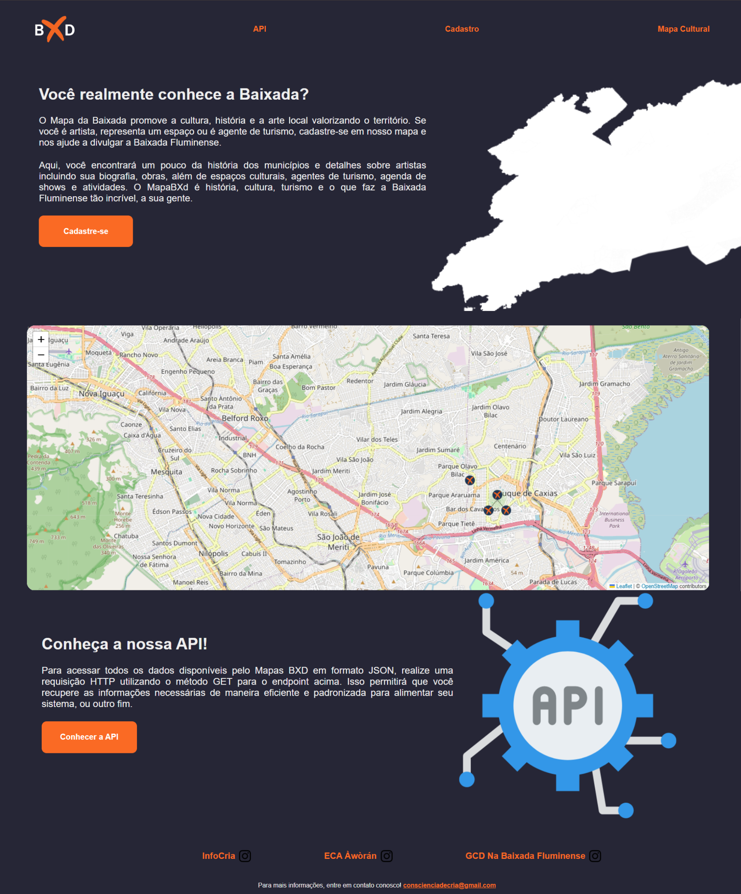

# Mapa MXD

Visando promover a produção de cultura na região geográfica da Baixada Fluminense, o coletivo InforCrias, através do setor de desenvolvimento de software liderado por Adeilton dos Santos, desenvolveu o Mapa MXD. Este é um mapa de fomento de atividades culturais, fornecendo uma API em JSON para requisição de dados pelos coletivos culturais.

## Visão Geral

O Mapa MXD é uma ferramenta inovadora destinada a coletivos culturais e organizações que atuam na Baixada Fluminense. Ele facilita o acesso a informações sobre eventos, atividades e iniciativas culturais na região, promovendo a colaboração e o crescimento da produção cultural local.

## Funcionalidades Principais

- **Mapa Interativo**: Visualização geográfica das atividades culturais na Baixada Fluminense utilizando dados do OpenStreetMap.
- **API em JSON**: Fornecimento de dados estruturados para integração com outras plataformas e aplicativos.
- **Requisição de Dados**: Coletivos culturais podem requisitar informações específicas sobre eventos e atividades culturais.
- **Fomento Cultural**: Apoio à divulgação e organização de eventos culturais na região.

## Tecnologias Utilizadas

- **Python**: Linguagem de programação utilizada para o desenvolvimento do backend.
- **OpenStreetMap**: Plataforma de mapeamento colaborativo utilizada para criar mapas interativos.
- **Supabase**: Plataforma de banco de dados que oferece funcionalidades como autenticação, armazenamento de dados e APIs em tempo real.
- **PostgreSQL**: Banco de dados relacional utilizado para armazenar e gerenciar informações.

